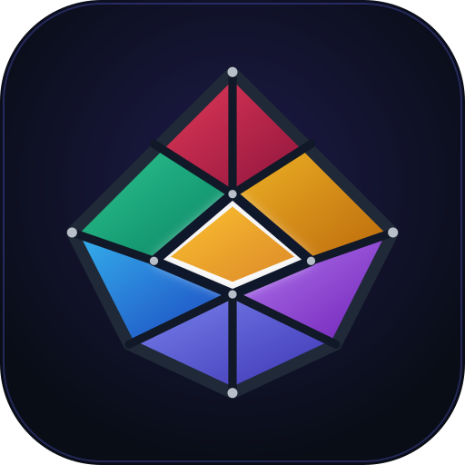
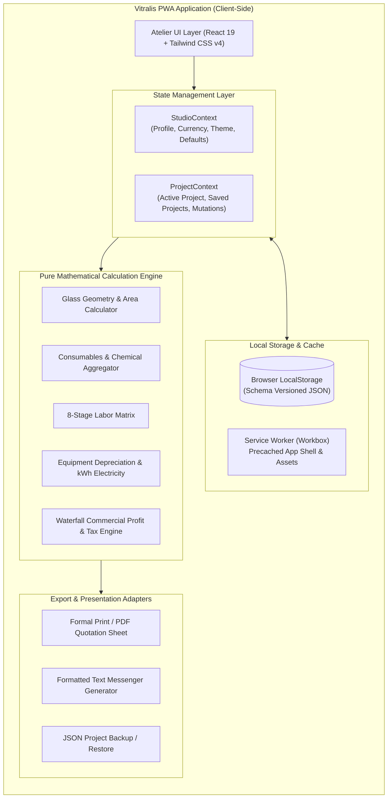
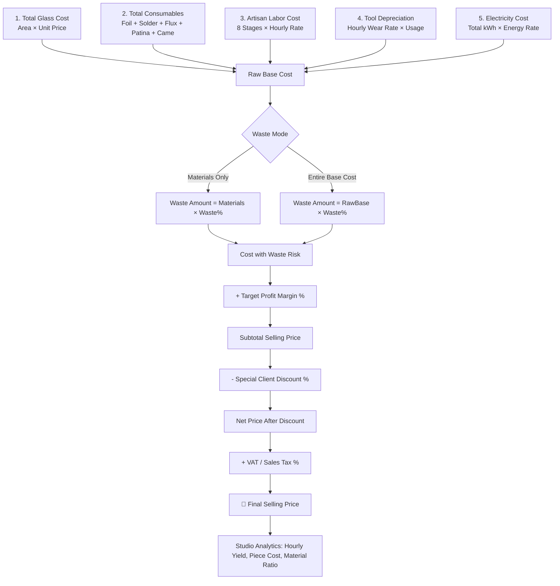
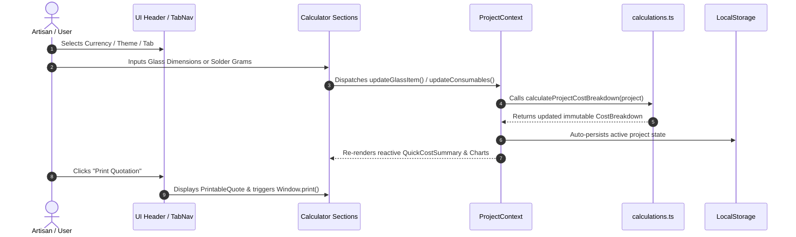

<div style="text-align: center;">
    <h1>Vitralis</h1>
    <p>Stained Glass & Tiffany Studio Cost Calculator</p>
    
</div>

<div style="text-align: center;">
  <strong>Comprehensive Cost Accounting, Quotation Generator, and Progressive Web App (PWA) for Stained Glass Artisans and Tiffany Technique Workshops.</strong>
</div>

<div style="text-align: center;">
  
  
  
  
  
  
  
  
  
</div>

---

## 📑 Table of Contents

- [💎 Overview & Vision](#-overview--vision)
- [✨ Key Features](#-key-features)
- [📊 System Architecture & Diagrams](#-system-architecture--diagrams)
    - [1. High-Level System Architecture](#1-high-level-system-architecture)
    - [2. Cost Calculation Waterfall Pipeline](#2-cost-calculation-waterfall-pipeline)
    - [3. Application State & Context Flow](#3-application-state--context-flow)
- [📐 Mathematical Formulation & Cost Logic](#-mathematical-formulation--cost-logic)
- [💡 Artisan Rules of Thumb](#-artisan-rules-of-thumb)
- [🛠 Tech Stack & Libraries](#-tech-stack--libraries)
- [📂 Project Architecture](#-project-architecture)
- [🚀 Getting Started & Local Development](#-getting-started--local-development)
- [🧪 Testing & Quality Assurance](#-testing--quality-assurance)
- [🔧 CI/CD & DevOps Automation](#-cicd--devops-automation)
    - [1. Continuous Integration (CI)](#1-continuous-integration-ci)
    - [2. Continuous Deployment (CD)](#2-continuous-deployment-cd)
    - [3. Dependabot Dependency Management](#3-dependabot-dependency-management)
    - [4. Automated Releases with Release Please](#4-automated-releases-with-release-please)
- [📱 Progressive Web App (PWA) Capabilities](#-progressive-web-app-pwa-capabilities)
- [🤝 Contributing & Community](#-contributing--community)
- [📜 License](#-license)

---

## 💎 Overview & Vision

**Vitralis** is a zero-latency, offline-first Progressive Web App (PWA) specifically engineered for stained glass
artisans, Tiffany lamp creators, and architectural leaded glass studios.

Crafting stained glass involves layered and volatile material costs (colored cathedral/opal sheets, copper foil rolls,
high-grade tin-lead solders, toxic patina chemicals), high-wear diamond tools (grinders, cutter heads, soldering tips),
intensive electrical consumption, and meticulous multi-stage labor.

Vitralis replaces guesswork and spreadsheets with:

- **Exact Mathematical Cost Modeling:** Instant recalculation across glass geometries, consumables, tool wear, and kWh
  electricity.
- **Craftsman Ergonomics:** Anti-AI-slop atelier design language, 8-state tactile inputs, and responsive dark/light
  themes.
- **Client-Ready Commercial Outputs:** Formal print/PDF quotation sheets, WhatsApp text summaries, and JSON backup
  portability.
- **100% Client-Side Privacy:** No external backend required; all project and studio records are securely stored locally
  via schema-versioned `LocalStorage`.

---

## ✨ Key Features

| Category                             | Highlights                                                                                                                                                     |
|:-------------------------------------|:---------------------------------------------------------------------------------------------------------------------------------------------------------------|
| **🎨 Multi-Glass Geometry Engine**   | Rectangles ($W \times H$), Circles ($\varnothing$), custom polygons ($\text{cm}^2 / \text{m}^2$), per-$\text{m}^2$, per-$\text{cm}^2$, or whole-sheet costing. |
| **🧵 Consumables Accounting**        | Black/Copper/Silver backed foils, 60/40 & 50/50 solder alloys, flux, black/copper patina, zinc came, brass rods, hanging rings & chains.                       |
| **⏳ 8-Stage Artisan Labor**         | Cartooning/design, scoring/breaking, grinding/fitting, foiling, soldering & beading, patina/waxing, framing, shockproof packaging.                             |
| **⚙️ Tool Depreciation**             | Proportional wear on grinder machines, diamond cutter heads, soldering stations, running pliers, and LED workbenches.                                          |
| **⚡ Energy & Power Metering**       | Aggregates active tool wattages and calculates exact kilowatt-hour (kWh) utility expenses based on regional studio rates.                                      |
| **🛡️ Waste & Breakage Insurance**    | Configurable glass breakage risk factor (%) applied to materials or entire base cost.                                                                          |
| **📈 Commercial Margin & Analytics** | Target profit markup (%), discount deduction, VAT/Sales tax toggle, effective hourly studio yield ($\text{₺/hr}$ or $\$ /\text{hr}$).                          |
| **📄 Quotation & Export Engine**     | Formal printable certificate/quote document (`@media print`), PDF generation, one-click WhatsApp text format, JSON import/export.                              |
| **🧰 Artisan Utility Modals**        | Solder weight estimator based on linear foil and bead profile, circular area calculator, glass piece perimeter estimator.                                      |
| **🌍 Localization & Currencies**     | Full Turkish (TR) and English (EN) translations with native support for `TRY (₺)`, `USD ($)`, `EUR (€)`, `GBP (£)`, `CAD (CA$)`, `AUD (A$)`, `CHF`.            |
| **📱 Offline PWA Architecture**      | Standalone home screen installation, service worker precaching, and instant offline boot.                                                                      |

---

## 📊 System Architecture & Diagrams

### 1. High-Level System Architecture



---

### 2. Cost Calculation Waterfall Pipeline



---

### 3. Application State & Context Flow



---

## 📐 Mathematical Formulation & Cost Logic

Vitralis executes calculations using strict floating-point math verified with automated unit tests:

### 1. Glass Surface Area & Pricing

$$\text{Area}_{\text{Rect}} = \frac{W_{\text{cm}} \times H_{\text{cm}}}{10000}, \quad \text{Area}_{\text{Circle}} = \frac{\pi \times (D_{\text{cm}} / 2)^2}{10000}$$
$$\text{Total Glass Cost} = \sum_{i=1}^{N} \left (\text{Area}_i \times \text{Quantity}_i \times \text{UnitPrice}_i \right)$$

### 2. Consumables Aggregation

$$\text{Foil Cost} = \text{Length}_{\text{m}} \times \left (\frac{\text{Roll Price}}{\text{Roll Length}_{\text{m}}} \right)$$
$$\text{Solder Cost} = \text{Weight}_{\text{g}} \times \left (\frac{\text{Spool Price}}{\text{Spool Weight}_{\text{g}}} \right)$$
$$\text{Total Consumables} = \text{Foil} + \text{Solder} + \text{Flux} + \text{Patina} + \text{Came} + \text{Reinforcement} + \text{Custom Consumables}$$

### 3. Equipment Depreciation & Utility Power

$$\text{Tool Wear Cost} = \sum \left (\frac{\text{Tool Purchase Price}}{\text{Expected Lifespan Hours}} \times \text{Project Usage Hours} \right)$$
$$\text{Electricity Cost} = \left (\sum \frac{\text{Device Watts} \times \text{Hours}}{1000} \right) \times \text{Electricity Rate per kWh}$$

### 4. Commercial Markup & Studio Yield

$$\text{Raw Base Cost} = \text{Glass} + \text{Consumables} + \text{Labor} + \text{Depreciation} + \text{Electricity}$$
$$\text{Cost with Waste} = \text{Raw Base Cost} + \text{Waste Amount}$$
$$\text{Subtotal Price} = \text{Cost with Waste} \times \left (1 + \frac{\text{Profit Margin \%}}{100}\right)$$
$$\text{Final Selling Price} = (\text{Subtotal Price} - \text{Discount}) \times \left (1 + \frac{\text{Tax \%}}{100}\right)$$
$$\text{Effective Hourly Yield} = \frac{\text{Net Profit Amount} + \text{Total Labor Cost}}{\text{Total Labor Hours}}$$

---

## 💡 Artisan Rules of Thumb

Vitralis incorporates real-world workshop benchmarks collected from experienced stained glass artists:

1. **Solder to Foil Ratio:**
    - For standard $7/32''$ ($5.5\text{mm}$) copper foil with balanced front and back bead lines:
      $$\text{Estimated Solder (g)} \approx \text{Foil Length (m)} \times 18\text{g to } 22\text{g}$$
2. **Foil Length Approximation from Piece Count:**
    - For decorative organic panels with average piece perimeters of $18\text{cm}-24\text{cm}$:
      $$\text{Estimated Foil (m)} \approx \frac{\text{Piece Count} \times \text{Avg Perimeter (cm)}}{175}$$
3. **Glass Cutting Scrap & Breakage Margin:**
    - Standard geometric designs: $10\% - 12\%$
    - Intricate curves, deep concave cuts, or mouth-blown antique glass: $20\% - 25\%$

---

## 🛠 Tech Stack & Libraries

* **Core Framework:** React 19.2 (Functional Components, Hooks, Context API)
* **Type System:** TypeScript 6.0 (Strict mode, full interface coverage)
* **Build Tool:** Vite 8.2 (Lightning fast HMR, Rollup production bundles)
* **Styling & Design System:** Tailwind CSS v4.3 with custom glassmorphism tokens and `@custom-variant dark`
* **Icons:** Lucide React
* **Test Runner:** Vitest 4.1 (Fast unit test suite)
* **PWA & Service Worker:** `vite-plugin-pwa` + Google Workbox
* **Visual Effects:** Canvas Confetti for project save celebrations

---

## 📂 Project Architecture

```
vitralis/
├── .github/
│   ├── dependabot.yml               # Automated weekly dependency updates
│   └── workflows/
│       ├── ci.yml                   # CI: Lint, Typecheck, Test, Build
│       ├── deploy.yml               # CD: Automated deployment to GitHub Pages
│       ├── release-please.yml       # Release Please: Semantic release & CHANGELOG
│       └── dependabot-auto-merge.yml# Auto-merge for non-major dependabot PRs
├── public/
│   ├── favicon.svg                  # SVG vector favicon
│   ├── favicon-96x96.png            # High-res desktop favicon
│   ├── favicon.ico                  # Legacy browser favicon
│   ├── apple-touch-icon.png         # iOS touch icon
│   ├── web-app-manifest-192x192.png # PWA 192x192 icon
│   ├── web-app-manifest-512x512.png # PWA 512x512 icon
│   └── site.webmanifest             # Web application manifest
├── src/
│   ├── types/
│   │   ├── project.ts               # Stained glass data models & cost structures
│   │   └── studio.ts                # Studio profile, currencies & defaults
│   ├── constants/
│   │   ├── defaults.ts              # Currencies, default tools, fallback project
│   │   └── templates.ts             # Pre-configured templates (Suncatcher, Lamp, Panel)
│   ├── context/
│   │   ├── StudioContext.tsx        # Studio settings, theme & language state
│   │   └── ProjectContext.tsx       # Live calculations, storage & project actions
│   ├── utils/
│   │   ├── calculations.ts          # Pure mathematical cost engine
│   │   ├── calculations.test.ts     # Automated unit test suite
│   │   ├── formatters.ts            # Currency, area, time, and percentage formatters
│   │   └── exportUtils.ts           # JSON export/import & WhatsApp quote copy
│   ├── i18n/
│   │   ├── tr.ts                    # Turkish localization dictionary
│   │   ├── en.ts                    # English localization dictionary
│   │   └── index.ts                 # Translation helper
│   ├── components/
│   │   ├── common/
│   │   │   ├── Header.tsx           # Atelier header, currency/language selectors
│   │   │   ├── TabNavigation.tsx    # Responsive segmented navigation
│   │   │   ├── QuickCostSummary.tsx # Sticky live calculation ledger
│   │   │   ├── CustomSelect.tsx     # Custom accessible tactile dropdown popover
│   │   │   ├── GlassCard.tsx        # Accordion-enabled glass container
│   │   │   ├── NumberInput.tsx      # Spinner-free number input with units
│   │   │   └── Modal.tsx            # Accessible modal dialog
│   │   ├── calculator/
│   │   │   ├── GlassSection.tsx     # Multi-glass items & shape calculators
│   │   │   ├── ConsumablesSection.tsx # Foil, solder, chemicals & came
│   │   │   ├── LaborSection.tsx     # 8-stage artisan labor breakdown
│   │   │   ├── EquipmentSection.tsx # Tool wear & machine depreciation
│   │   │   ├── ElectricitySection.tsx # Wattage & kWh electricity consumption
│   │   │   ├── MarginWasteSection.tsx # Waste risk, profit margin & taxes
│   │   │   └── CostBreakdownChart.tsx # SVG donut visualization & studio KPIs
│   │   ├── projects/
│   │   │   ├── ProjectManager.tsx   # Saved project search, filter & backup
│   │   │   └── TemplateSelector.tsx # Pre-built stained glass starter presets
│   │   ├── quote/
│   │   │   └── PrintableQuote.tsx   # Formal print/PDF quotation document
│   │   ├── studio/
│   │   │   └── StudioSettings.tsx   # Workshop hourly rates & default prices
│   │   ├── tools/
│   │   │   └── ArtisanToolsModal.tsx# Solder estimator & geometry helpers
│   │   └── pwa/
│   │       └── PWAInstallBanner.tsx # PWA install prompt & offline status
│   ├── App.tsx                      # Root workbench view & layout
│   ├── index.css                    # Tailwind CSS v4 & custom design tokens
│   └── main.tsx                     # Application bootstrapping
├── .release-please-manifest.json    # Release Please version manifest
├── release-please-config.json       # Release Please configuration
├── eslint.config.js                 # ESLint flat config
├── package.json                     # Scripts & project dependencies
├── tsconfig.json                    # TypeScript compiler options
├── vite.config.ts                   # Vite & PWA bundler configuration
└── README.md                        # Documentation
```

---

## 🚀 Getting Started & Local Development

### Prerequisites

- **Node.js:** v18.0.0 or newer (v22 recommended)
- **Package Manager:** npm, pnpm, or yarn

### Quick Installation

```bash
# 1. Clone the repository
git clone https://github.com/your-username/vitralis.git
cd vitralis

# 2. Install dependencies
npm ci

# 3. Start local development server
npm run dev
```

Open [http://localhost:5173](http://localhost:5173) in your browser.

---

## 🧪 Testing & Quality Assurance

Vitralis includes a full suite of automated unit tests covering all core calculation formulas and formatting utilities:

| Command             | Description                                       |
|:--------------------|:--------------------------------------------------|
| `npm test`          | Runs the Vitest automated test suite              |
| `npm run lint`      | Performs static code analysis with ESLint         |
| `npm run typecheck` | Validates TypeScript types (`tsc -b --noEmit`)    |
| `npm run validate`  | Runs Lint + Typecheck + Tests + Build in one step |
| `npm run build`     | Builds the production bundle & PWA service worker |

```bash
$ npm run validate

✓ ESLint: 0 errors
✓ TypeScript: Clean type check
✓ Vitest: 4/4 calculation unit tests passed
✓ Vite: Production bundle generated (dist/)
```

---

## 🔧 CI/CD & DevOps Automation

Vitralis utilizes fully automated GitHub Actions workflows for continuous integration, zero-downtime deployment, and
automated semantic releases:

### 1. Continuous Integration (CI)

* **Workflow:** [`.github/workflows/ci.yml`](.github/workflows/ci.yml)
* **Triggers:** Push & Pull Request on `main`, `master`, `develop`.
* **Checks:** `npm ci` ➔ `npm run lint` ➔ `npm run typecheck` ➔ `npm test` ➔ `npm run build` ➔ Artifact Verification.

### 2. Continuous Deployment (CD)

* **Workflow:** [`.github/workflows/deploy.yml`](.github/workflows/deploy.yml)
* **Target:** GitHub Pages (`actions/deploy-pages@v4`).
* **Triggers:** Pushes to `main` branch.

### 3. Dependabot Dependency Management

* **Config:** [`.github/dependabot.yml`](.github/dependabot.yml)
* **Schedule:** Weekly dependency vulnerability & version auditing.
* **Auto-Merge:** [`.github/workflows/dependabot-auto-merge.yml`](.github/workflows/dependabot-auto-merge.yml)
  automatically merges passing minor/patch dependency PRs.

### 4. Automated Releases with Release Please

* **Workflow:** [`.github/workflows/release-please.yml`](.github/workflows/release-please.yml)
* **Powered by:** Google's `release-please-action`.
* Automatically analyzes Conventional Commits, maintains `CHANGELOG.md`, bumps `package.json` semver, and tags GitHub
  Releases.

---

## 📱 Progressive Web App (PWA) Capabilities

Vitralis is engineered as a modern Progressive Web App:

- **Offline Reliability:** Service Worker precaches all HTML, CSS, JavaScript, web fonts, and manifest assets.
- **App Installation:** Native "Add to Home Screen" prompt for iOS Safari, Android Chrome, macOS, and Windows.
- **Fast Startup:** Sub-100ms startup times without network roundtrips.

---

## 🤝 Contributing & Community

Contributions are warmly welcome! Please read our guidelines before submitting pull requests:

* 📖 **[Contribution Guidelines](CONTRIBUTING.md)**: Development setup, workflow, and coding standards.
* 📜 **[Code of Conduct](CODE_OF_CONDUCT.md)**: Our pledge to a welcoming and inclusive community.
* 🔒 **[Security Policy](SECURITY.md)**: Reporting vulnerabilities and client-side security standards.
* 📝 **[Changelog](CHANGELOG.md)**: Full record of releases and version history.
* 📐 **[Calculation Formulas Guide](docs/FORMULAS.md)**: In-depth mathematical breakdowns and artisan heuristics.

---

## 📜 License

This project is licensed under the **[MIT License](LICENSE)** — feel free to use, modify, and distribute for personal, studio, or commercial purposes.

---

<div style="text-align: center;">
  Crafted with precision for stained glass artisans & studios worldwide. 🪟✨
</div>
